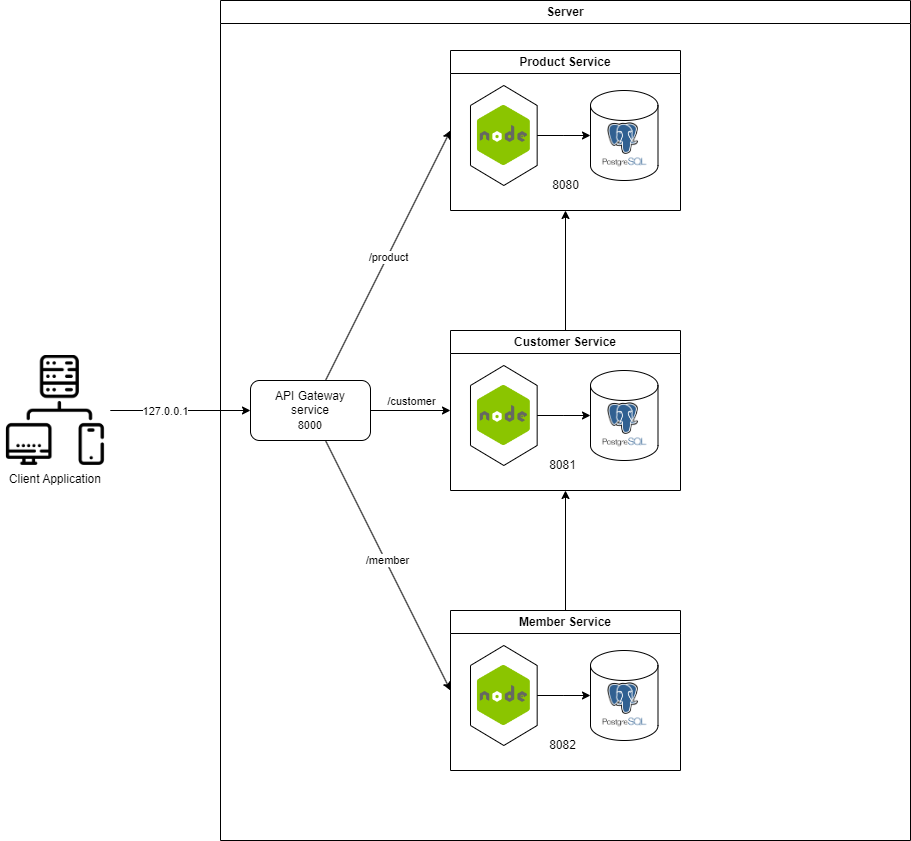
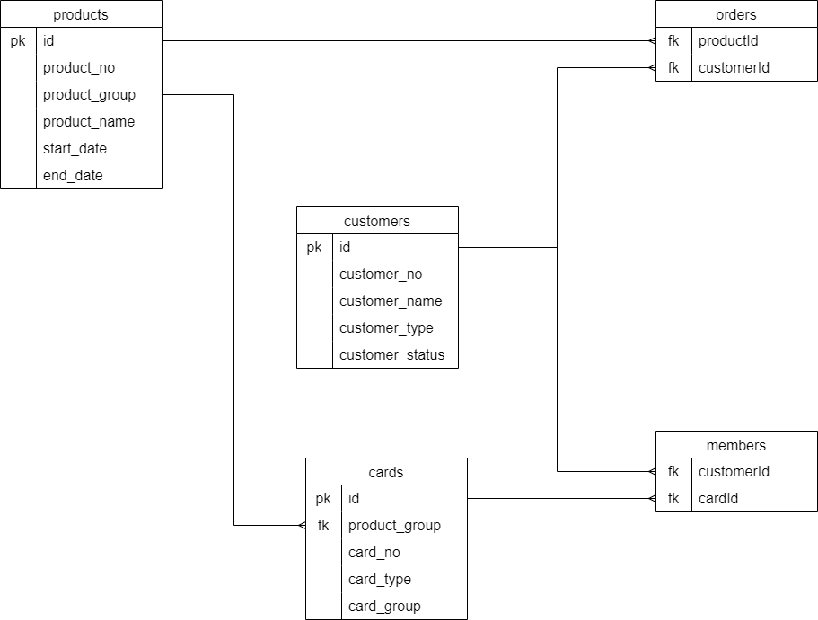
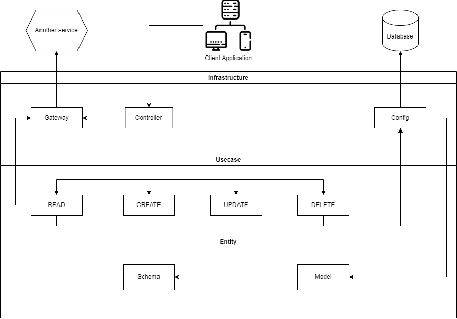

# Orders of customer microservice by Nodejs
### I have try to build mini microservice project .

## First, Microservice architect diagram

### API gateway is Reverse Proxy between each service, And  then Customer service can request to Product service and Member service can request to Customer service too.

## Second, Data Relationship diagram

### Customer can have many products and Product can have many customer. So Orders is contain product and customer. Next Cards must have product group so Products is relate to Cards then  Customer can have many cards and Card can have many customer too. So Members is contain card and customer.

## Lastly, Service architecture diagram

## In the future I will make it into containerize bt docker soon.